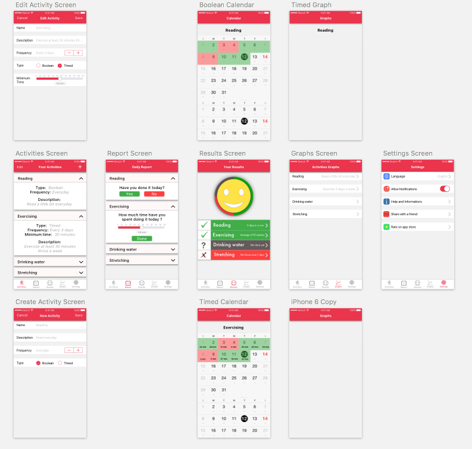

# Habits Manager
######Lose good habits, get better ones.

## Purpose
In this app, you can add objectives, and be reminded to follow them.
Everyday, you can report what you have done and the app will keep track of it.
You can see your improvements in the form of a calendar and (incoming) graphs for each activity.

The app supports two types of activities for now:
- **Booleans:** Can be done or not
- *I ran today*
- **Timed:** Requires to be done during a given amount of time
- *I have to run 30 minutes today*

The iOS version is coded natively using Swift 3.

## Design (I tried)
Done using Sketch.

